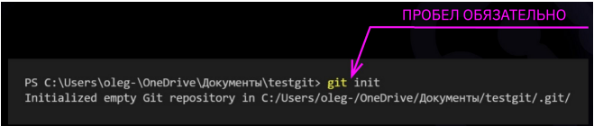
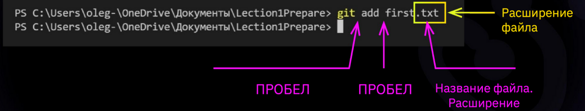
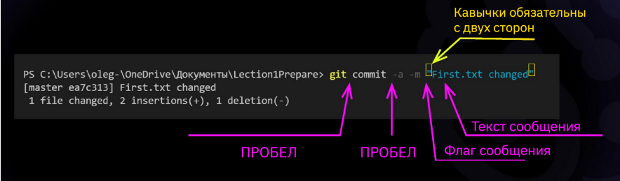
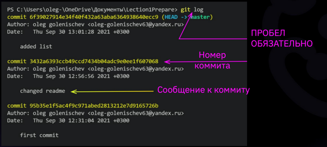
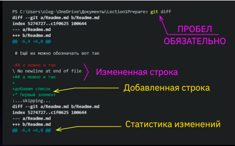

# GB_HomeWork
# Git Commands

* **git --version** - *проверить версию Git*

* **git init** - *создание репозитория*

* **git status** - *проверить текущее состояние Git, есть ли изменения, которые нужно сохранить*

* **git add "название файла"** - *добавление файла для последующего коммита*

* **git commit -m "сообщение"** - *сохранить текущее состояние файла, добавленного при помощи git add*

* **git log** - **посмотреть журнал коммитов**

* **git checkout "номер коммита"** - *загрузить сохраненную версию. в номере коммита можно указывать только первые 4 символа*

* **git checkout main/master** - *загрузить последнюю актуальную версию*

*  **git diff** - *посмотреть отличие между текущим файлом и сохраненным*

<<<<<<< HEAD
## Кодовые фрагменты строк

Чтобы отметить фрагмент строки, содержащий код, необходимо окружить его обратными апострофами «`». При использовании кодовых фрагментов строк текст будет отображаться в виде моноширинного шрифта. В отличие от блоков кода, кодовый фрагмент позволяет поместить код внутрь обычного абзаца текста. Кодовый фрагмент строки в языке Markdown выглядит следующим образом:

Используйте оператор `if`

## СПИСКИ
### Упорядоченные списки. В качестве мааркеров используются числа с точкой:
1.
2.
3.
### Неупорядоченные списки. Используются такие маркеры, как звездочки, плюсы и дефисы (\* + -), которые ставятся вначале строки
*
+
-

# ЗАГОЛОВКИ:
Для выделения заголовков используется символ решетка \#
# \#  Заголовок первого уровня #
## \## Заголовок второго уровня ##
###### \###### Заголовок шестого уровня ######

## Дополнительные элементы:
Чтобы специаальные символы воспринимались в их буквальном (а не служебном) значении, используется обратный слэш. 

Вот так: \\ * + - _ [] {} () # ! .
>>>>>>> additional_elements

[***Ссылка на полный конпект лекции***](https://gbcdn.mrgcdn.ru/uploads/asset/3937510/attachment/187904bc7fa424abc113f5dda8b497ff.pdf)

# **Работа с удаленными репозиториями**

- [ ]  Пройти тренажер по удаленным репозиториям [https://learngitbranching.js.org/?locale=ru_RU](https://learngitbranching.js.org/?locale=ru_RU)
- [x]  Создаем аккаунт в GitHub, который позволяет вести совместные проекты:

- new repository - название - create repository

## **Копирование репозитория**

- git clone [ссылка] - скачивание удаленного репозитория к себе на компьютер для локальной работы (code - clone)

- git cd [название папки] - перейти в папку склонированного репозитория

## **Выгрузка локального репозитория на GitHub**

- Создаем локальный репозиторий, делаем коммит

- git remote add origin [ссылка на удаленный репозиторий] - добавляем связку локального и удаленного репозиториев (должны бы авторизированы на GitHub)

- git branch -M main - перейти в главную ветку выгруженного репозитория

## **Действия**

- git push -u origin main - отправить данные с локального репозитория в удаленный в ветку main

- git pull - скачать данные с удаленного в локальный (при этом происходит merge)

## **Запросить изменения в чужой репозиторий:**

- На GitHub выбрать “fork” - создаем копию чужого удаленного репозитория на своем аккаунте в GutHub

- Копируем указанный репозиторий себе на компьютер с помощью git clone

- Делаем изменения, создаем новые ветки, делаем коммиты

- Выгружаем изменения на удаленный репозиторий с помощью git push

- На GitHub появляется кнопка Compare and pull request - нажимаем ее - сравнивает версии и отправляет запрос на изменения в основной репозиторий, с которого мы делали fork

- Пишем комментарий и нажимаем create pull request в GitHub, после этого в аккаунте основного репозитория появится наш запрос на изменения