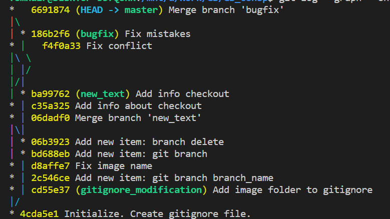
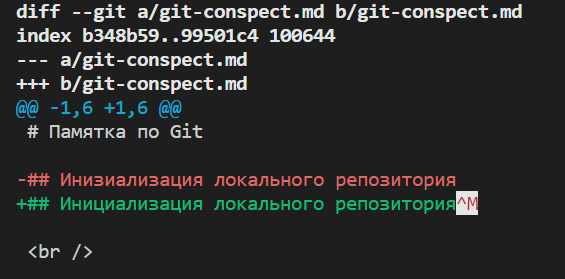

# Памятка по Git

## Инициализация локального репозитория

<br />

### **git init**

<br />

```bash
$ git init
Initialized empty Git repository in /foldername
```

<br /><br />

## Информация о текущем состоянии репозитория

<br />

### **git status**

<br />

```bash
$ git status
On branch master # текущая ветка репозитория
Changes not staged for commit:
  (use "git add <file>..." to update what will be committed)
  (use "git restore <file>..." to discard changes in working directory)
        modified:   git-conspect.md
        # измененные файлы, зарегистрированные
        # с помощью git add
        # незафиксированы с помощью команды git commit

Untracked files:
  (use "git add <file>..." to include in what will be committed)
        "info.pdf"
        # файл, который не был добавлен с помощью комаанды git add

no changes added to commit (use "git add" and/or "git commit -a")
```

<br /><br />

## Добавить файл(ы) к следующему коммиту

<br />

### **git add**

<br />

```bash
$ git add .
# добавляет все файлы в папке
```

<br /><br />

## Создание коммита

<br />

### **git commit**

<br />

```bash
$ git commit -m "Message"
# добавляет коммит с параметром -m, позволяющим сразу ввести описание
```

<br /><br />

## История всех коммитов с их хэш-кодами

<br />

### **git log**

<br />

```bash
$ git log # команда без параметров выводит полные логи коммитов
commit f99a0f286774c9879e27c02c14934eb52c9301cc (HEAD -> master)
Author: Oleg Gromenkov <box.offlame@gmail.com>
Date:   Thu Sep 29 21:46:24 2022 +0300

    Create and add scrennshot of git diff output

commit d45ad84950645e28f2679b82cd4c2d3a0e15dd32
Author: Oleg Gromenkov <box.offlame@gmail.com>
Date:   Thu Sep 29 21:12:10 2022 +0300

    Add description for commands

commit 092dbab10de3ea89f32cbafb8bddcce70ad0480e
Author: Oleg Gromenkov <box.offlame@gmail.com>
Date:   Thu Sep 29 20:41:28 2022 +0300

    Create git-conspect.md
```

<br />

### **git log форматирование**

<br />

```bash
$ git log --pretty=format:"%h - %ad : %s"
f99a0f2 - Thu Sep 29 21:46:24 2022 +0300 : Create and add scrennshot of git diff output
d45ad84 - Thu Sep 29 21:12:10 2022 +0300 : Add description for commands
092dbab - Thu Sep 29 20:41:28 2022 +0300 : Create git-conspect.md
```

<table>
 <tr>
  <th>Параметр</th>
  <th>Описание</th>
 </tr>
 <tr>
  <td>%H</td>
  <td>Хэш коммита</td>
 </tr>
 <tr>
  <td>%h</td>
  <td>Сокращенный хеш коммита</td>
 </tr>
 <tr>
  <td>%an</td>
  <td>Имя автора</td>
 </tr>
 <tr>
  <td>%ad</td>
  <td>Дата</td>
 </tr>
 <tr>
  <td>%s</td>
  <td>Коммит</td>
 </tr>
</table>

<br />

## Вывести графическое отображение веток

### **git log --graph --oneline**

<br />



<br />

[Подробная статья про git log](https://git-scm.com/book/ru/v2/%D0%9E%D1%81%D0%BD%D0%BE%D0%B2%D1%8B-Git-%D0%9F%D1%80%D0%BE%D1%81%D0%BC%D0%BE%D1%82%D1%80-%D0%B8%D1%81%D1%82%D0%BE%D1%80%D0%B8%D0%B8-%D0%BA%D0%BE%D0%BC%D0%BC%D0%B8%D1%82%D0%BE%D0%B2)

<br /><br />

## Переход между коммитами

<br />

### **git checkout**

<br />

```bash
$ git checkout d45ad84
```

### Результат вывода команды git status:

<br />

```bash
$ git status
HEAD detached at d45ad84
nothing to commit, working tree clean
```

<br />

### Возврат к актуальному состоянию:

### **git checkout master**

<br />

```bash
$ git checkout master
Previous HEAD position was d45ad84 Add description for commands
Switched to branch 'master'
```

<br />

### Переключение между ветками:

### **git checkout branch_name**

<br />

```bash
$ git checkout branch_name
Switched to branch 'branch_name'
```

<br /><br />

## Разница между текущим и закоммиченным файлом

<br />

### **git diff**

<br />



<br /><br />

## Показать список веток в репозитории

<br />

### **git branch**

<br />

```bash
$ git branch
* master # текущая ветка
  new_text
```

<br /><br />

## Создание новой ветки

<br />

### **git branch branch_name**

<br />

```bash
$ git branch branch_name
```

<br /><br />

## Удаление ветки

<br />

### **git branch -d branch_name**

<br />

```bash
$ git branch -d branch_name
Deleted branch test (was bd688eb).
```

<br /><br />
